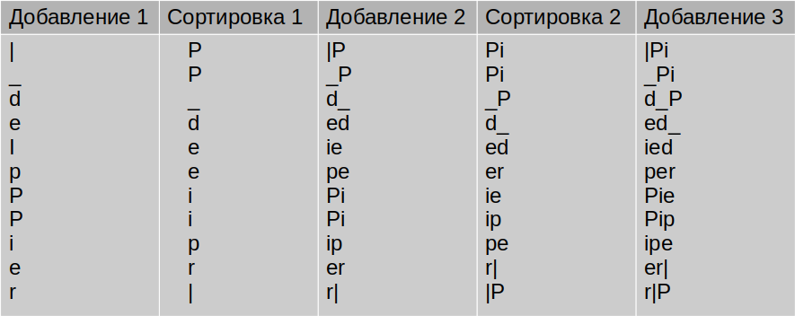

Напишите программу, которая делает обратное преобразование Алгоритма Барроуза-Уилера

Алгоритм заключается в разбиении входной строки (строка преобразованная алгоритмом ) на символы,после чего образуется столбец (на рисунке добавление 1)

Лексикографически(по алфавиту) сортируют образованные строки. После к полученному добавляют слева символы из добавления 1. Снова сортируют, и т.д. до тех пор, пока количество символов в полученных строках не станет равным количеству символов во входной строке. 

При столбцах, где есть добавление добавляем символы из первого столбца. 

В конце образуется столбец, где искомая строка это строка c символом конца строки. Символ конца строки обозначается |.

На рисунке изображены начальные шаги алгоритма. 

Лексикографическая сортировка производится в соответствии с таблицей символов Unicode. 

Длина входной строки до 100 символов

Пример входных данных: |_deipPPier

Пример выходных данных: Pied_Piper|