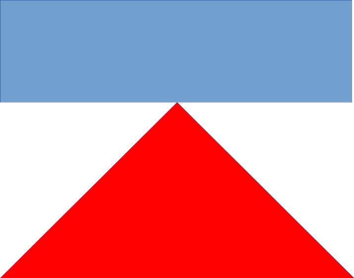

В мире Дикого запада идет война. Главнокомандующие разработали стратегию клина. Чтобы сбить ряды противника.

На рисунке изображен клин треугольником, ряды противника прямоугольником.

Чтобы образовать клин надо, знать число человек в ряду противника, в задней части клина количество участников равно количеству человек в ряду у противника. В каждом ряду клина на два участника меньше, чем в предыдущем ряду. На острой части клина может быть либо 2 либо 1 участник.

Так если в ряду у противника 9 человек то ряды клина состоят из такого количества человек:

9

7

5

3

1

Или для 6 человек в ряду у противника:

6

4

2

По введенному числу количества человек в ряду у противника, найдите количество человек в клину

Пример входных данных: 9

Пример выходных данных: 25

Количество человек у противника может достигать 100