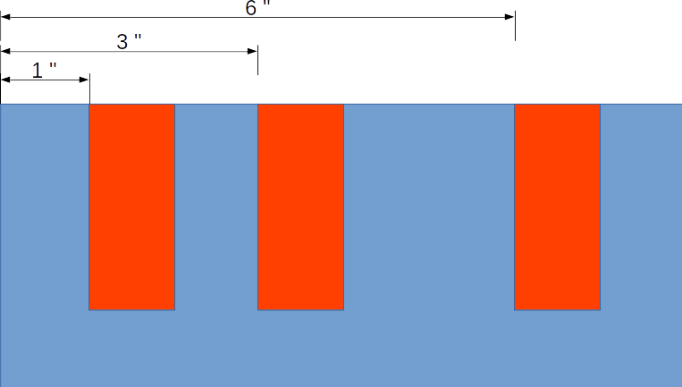

Дарлин взламывает тумбочку в квартире Эллиота.  

Замочна скважина устроена из барьеров, которые не позволяют сдвинуть замок, эти барьеры соответствуют прорезям на ключе. 

Когда ключ поворачивается, он поворачивает то пространство где нет барьеров. 

На картинке барьеры показаны розовым цветом. 

Дарлин замерила расстояние от входа в замочную скважину, до начала каждого барьера, они равны целым числам. 

Чтобы взломать замок, достаточно вставить в каждый промежуток между барьерами,а так же до первого барьера и после последнего палочки диаметром 1 и повернуть их одновременно. 

Расстояние между барьерами во входных данных не может быть меньше чем 1. Каждый барьер толщиной 1.

Барьеров может быть от 1 до 3. 

Ваша задача вывести модель самодельного ключа Дарлин. Где каждая палочка будет надета на основу, равную длине замка, каждая палочка высотой 3, в каждом промежутке между барьерами каждая палочка будет ближе к правой стороне. 

Для примера модель ключа из рисунка: 

X0X00X0X
X0X00X0X  
X0X00X0X  
XXXXXXXX  

Входные данные: расстояния от начала замочной скважины, до каждого барьера, и общая длина замочной скважины

Пример выходных данных: 

1,3,6,8

Выходные данные: нарисованная модель ключа Дарлин. Где X - ключ, 0 - пустое пространство.  

Пример выходных данных: 

X0X00X0X  
X0X00X0X  
X0X00X0X  
XXXXXXXX  