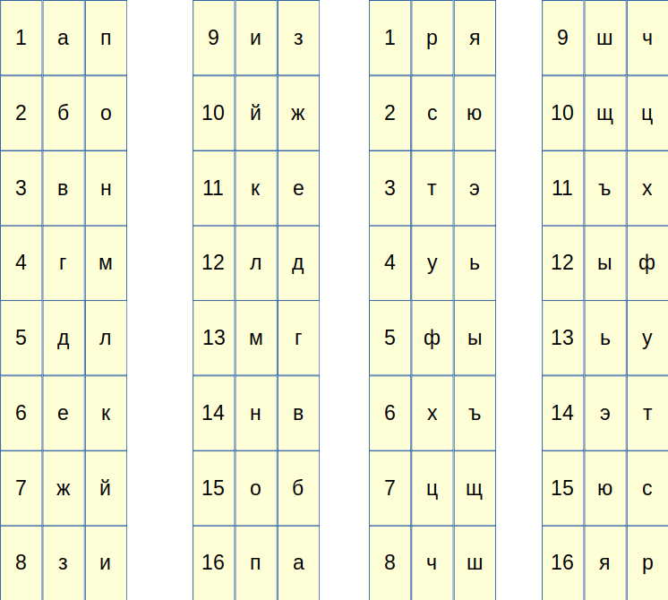

Литорея - метод шифрования русского алфавита, где Е и Ё объединяются. Остальные 32 символа разделяют на 2 группы по 16 штук, внутри группы производится зеркальная замена букв, что ближе к концу по местоположению в группе на те, что ближе к началу и наоборот.

Например: 1-я буква заменяется на 16-ю, а - п, 3-я буква заменяется на 14-ю в-н

Учитывайте регистр

Реализуйте данный метод шифрования. 

Входные данные: строка до 100 символов, на русском языке

Пример входных данных:  Мир это опасное место

Выходные данные: зашифрованная строка

Пример выходных данных: Гзя тэб бапювбк гкюэб