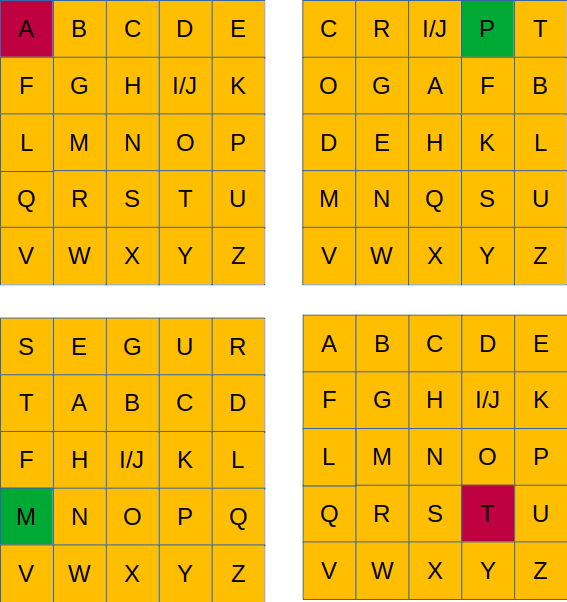

Шифр четырех квадратов использует 4 квадратных матрицы, размером зависящих от количества букв в алфавите, 5х5 в английском языке.

Чтобы добиться подходящего размера «I» и «J» объединяются в одной клетке. 

Алгоритм: 

Из заданной строки нужно убрать пробелы и поделить буквы попарно:

IW AN TE DT OS AV ET HE WO RL D

Берем каждую пару букв, и находим и в левом верхнем первую букву пары и правом нижнем вторую

Далее для каждой пары букв надо получить такую пару, состоящую из букв из правого верхнего и левого нижнего квадратов, стоящие на пересечении путей, при движении по вертикали и по горизонтали от начальных букв. Первая буква берется из правого верхнего квадрата, вторая буква из левого нижнего.

На рисунке показан пример для AT, в результате преобразования получим PM.

Полученную пару букв помещают в шифр в конец кодируемой строки. 

Повторяем алгоритм для всего сообщения. Если сообщение состоит из нечетного количества букв последнюю букву в кодируемом сообщении оставляем как есть. Регистр кодируемого сообщения верхний во всех входных и выходных данных. 

Входные данные: Вам будут даны квадратные матрицы для кодирования в последовательности: левый верхний квадрат, правый верхний, нижний левый, нижний правый. 

После в одну строку кодируемая фраза. 

Кодируемая фраза состоит из не более чем 100 символов. 

Для облегчения кодирования буква “J” отсутствует в правом верхнем и , левом нижнем квадратах.

Пример входных данных:

A,B,C,D,E

F,G,H,I/J,K

L,M,N,O,P

Q,R,S,T,U

V,W,X,Y,Z

C,R,I,P,T

O,G,A,F,B

D,E,H,K,L

M,N,Q,S,U

V,W,X,Y,Z

S,E,G,U,R

T,A,B,C,D

F,H,I,K,L

M,N,O,P,Q

V,W,X,Y,Z

A,B,C,D,E

F,G,H,I/J,K

L,M,N,O,P

Q,R,S,T,U

V,W,X,Y,Z

I WANTED TO SAVE THE WORLD

Пример выходных данных:

GYIFUUPPHPCVPQBGYHMHD