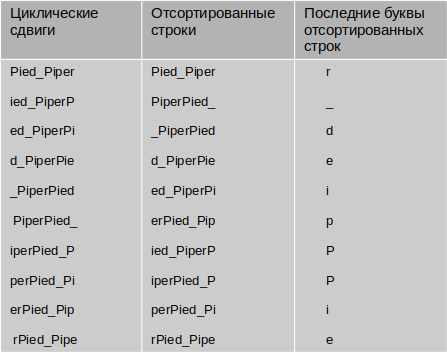

Напишите программу преобразования Барроуза-Уилера, которое используется перед применением алгоритма сжатия RLE, для большей его эффективности.  

Описание алгоритма преобразования Барроуза-Уилера: 

Составляется список всех циклических сдвигов входной строки.

Производится лексикографическая (в алфавитном порядке) сортировка списка.

В качестве выходной строки выбирается последние буквы отсортированных строк.

Лексикографическая сортировка происходит в соответствии с кодировкой Unicode 

Длина входной строки до 100 символов

Пример входных данных: Pied_Piper

Пример выходных данных: r_deipPPie